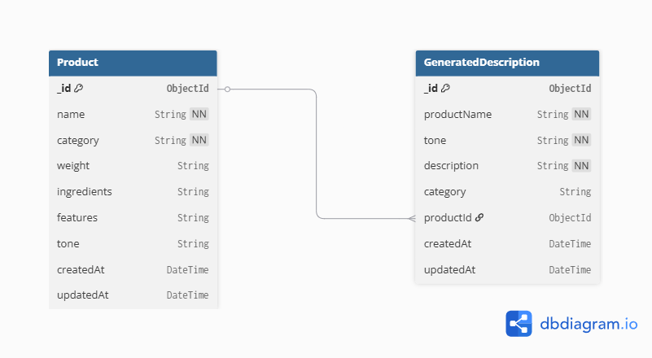

# HimShakti ListingAI

AI-powered product description generator for Himalayan food businesses.
Generate SEO-optimized listings for Amazon & Flipkart instantly.

## 🚀 Live Stack
- **Frontend:** React JS (Vite)
- **Backend:** Node.js + Express
- **Database:** MongoDB Atlas (Mongoose ODM)
- **AI:** Groq API (LLaMA 3.1 8B Instant)

---

## 🗄️ Database

**Choice:** MongoDB Atlas (M0 Free Tier)

**Why MongoDB?**
- Product data is document-based with flexible/variable fields
- No fixed schema needed — each Himalayan product has different attributes
- Mongoose ODM makes validation easy
- Atlas free tier perfect for internship-scale project

---

## 📊 Schema Diagram



### Entities:

**Product**
| Field | Type | Required |
|-------|------|----------|
| name | String | ✅ |
| category | String (enum) | ✅ |
| weight | String | ❌ |
| ingredients | String | ❌ |
| features | String | ❌ |
| tone | String (enum) | ❌ |
| createdAt | Date | auto |
| updatedAt | Date | auto |

**GeneratedDescription**
| Field | Type | Required |
|-------|------|----------|
| productName | String | ✅ |
| tone | String (enum) | ✅ |
| description | String | ✅ |
| category | String | ❌ |
| productId | ObjectId (ref: Product) | ❌ |
| createdAt | Date | auto |
| updatedAt | Date | auto |

**Relationship:** GeneratedDescription → Product (Many-to-One via productId)

---

## ⚙️ Setup — Database

1. Go to [mongodb.com/cloud/atlas](https://mongodb.com/cloud/atlas)
2. Create free M0 cluster
3. Whitelist your IP → Network Access → Add IP
4. Create DB user → Database Access
5. Get connection string → Connect → Drivers
6. Paste in `.env` as `MONGO_URI`

---

## 🔧 Local Setup

### Prerequisites
- Node.js v18+
- MongoDB Atlas account
- Groq API key ([console.groq.com](https://console.groq.com))

### Backend
```bash
cd backend
npm install
cp .env.example .env
# Fill in your MONGO_URI and GROQ_API_KEY in .env
npm run dev
```

### Frontend
```bash
cd frontend
npm install
npm run dev
```

### URLs
- Frontend: http://localhost:5173
- Backend: http://localhost:5000
- Generate: http://localhost:5173/generate
- Dashboard: http://localhost:5173/dashboard

---

## 📡 API Endpoints

| Method | Endpoint | Description |
|--------|----------|-------------|
| GET | /api/products | List all products |
| GET | /api/products/:id | Get single product |
| GET | /api/products/search?q= | Search products |
| POST | /api/products | Create product |
| PUT | /api/products/:id | Update product |
| DELETE | /api/products/:id | Delete product |
| POST | /api/generate | Generate AI description |
| GET | /api/generate/history | Generation history |

---

## 🌿 Features
- AI description generation with 3 tone styles
- Full CRUD product management
- MongoDB Atlas persistent storage
- Dark/Light mode
- Demo presets for HimShakti products
- Copy & download generated descriptions

---

## 👨‍💻 Intern
**Dhruv Verma** — TBI-GEU SIP26 | Intern ID: TBI-26100583
MCA (AI & ML) — Chandigarh University
